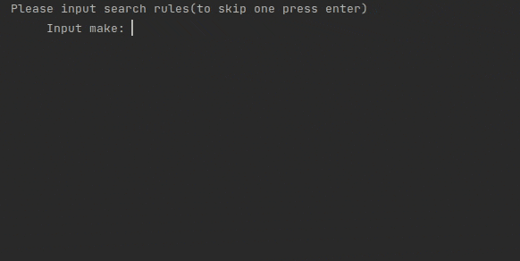

# Description
To run application, open terminal in folder with index.rb and run it

# Installation
```bash
git clone https://github.com/mirkru37/cars-management.git
cd cars-management
```

# Run
```bash
ruby index.rb
```

# Usage
After the start of the application, you need to choose menu option, of your choice.

```
x=========================x
|        Main menu        |
x===x=====================x
| 1 | Search new cars     |
| 2 | Show available cars |
| 3 | Help                |
| 4 | Change language     |
| 5 | Exit                |
x===x=====================x
```

## Search new cars
Here you can fill in search rules one by one.
If you want to skip one, leave an empty field.

**Rules are case insensitive**

**Rules marked with * require valid input data**

**Statistic is stored in *data/searches.yml***

### Table of validation
| Field  | Required value |
| ------------- | ------------- |
| year_(from/to)  | integer between 1800 and today's year  |
| price_(from/to)  | float under zero (**notice** that value will be rounded to two decimal places) |

### Rules
- make - takes one car brand you want to search
  >Input make: _Ford_
  >
  >Input make: ~~Ford Audi~~
- model - takes one car model
  >Input model: Focus 3
  >
  >Input model: ~~Mondeo Focus~~
- year_from - takes the smallest year of searchable cars *
- year_to - takes the biggest year of searchable cars *
  >Input year: 2015
  >
  >Input year: ~~1765 BC~~
  >
  >Input year: ~~two thousand and seventeenth~~
- price_from - takes the smallest price of searchable cars *
- price_to - takes the biggest price of searchable cars *
  >Input price: 20000
  >
  >Input price: ~~20 000~~
  >
  >Input price: ~~twenty thousands~~

After that you can input sort option. If you want **to skip**,
leave an **empty** field, and the **default** one will be chosen.
Also if you input **wrong** option, the **default** one will be chosen.

**Default** sorting is by **date_added** and **desc**

### searches.yml
```yaml
---
  - total_quantity: 2
    request_quantity: 6
    rules:
      - name: make
        value: ford
  - total_quantity: 0
    request_quantity: 3
    rules:
      - name: make
        value: volvo
    result: []
  - total_quantity: 1
    request_quantity: 1
    rules:
      - name: make
        value: ford
      - name: model
        value: focus
      - name: year_from
        value: 2010
      - name: year_to
        value: 2021
      - name: price_from
        value: 0.0
      - name: price_to
        value: 20000.0
```
## Show available cars
Here you will be showed a list of all available cars

## Help
Here you can see some hints that could help you to deal
with application
```
x=====================================================================================================x
|                                                Help                                                 |
x===================================x=================================================================x
| How i supposed to search a car?   | Just chose fist option in main menu by entering '1' in console, |
|                                   |  and then fill the rules as you want.                           |
| Can i see the all available cars? | And answer is YES, YOU CAN!!                                    |
|                                   |  Just enter '2' in console and we promise,                      |
|                                   |  you will see the in a flash.                                   |
x===================================x=================================================================x
```

## Change language
For now only Ukrainian an English languages are supported

## Exit
Leave the application
### Example


___
#### Input
```
Welcome to car-management. Search for any car of your dreams.
x=========================x
|        Main menu        |
x===x=====================x
| 1 | Search new cars     |
| 2 | Show available cars |
| 3 | Help                |
| 4 | Change language     |
| 5 | Exit                |
x===x=====================x
--> 3
x=====================================================================================================x
|                                                Help                                                 |
x===================================x=================================================================x
| How i supposed to search a car?   | Just chose fist option in main menu by entering '1' in console, |
|                                   |  and then fill the rules as you want.                           |
| Can i see the all available cars? | And answer is YES, YOU CAN!!                                    |
|                                   |  Just enter '2' in console and we promise,                      |
|                                   |  you will see the in a flash.                                   |
x===================================x=================================================================x
x=========================x
|        Main menu        |
x===x=====================x
| 1 | Search new cars     |
| 2 | Show available cars |
| 3 | Help                |
| 4 | Change language     |
| 5 | Exit                |
x===x=====================x
--> 4
Please choose language (uk | en)default: en
uk
x=======================x
|     Головне меню      |
x===x===================x
| 1 | Пошук машин       |
| 2 | Показати доступні |
| 3 | Справка           |
| 4 | Змінити мову      |
| 5 | Вихід             |
x===x===================x
--> 5
Дякуємо, що використовуєте наш сервіс. До побачення!
```
#### Input
```
Welcome to car-management. Search for any car of your dreams.
x=========================x
|        Main menu        |
x===x=====================x
| 1 | Search new cars     |
| 2 | Show available cars |
| 3 | Help                |
| 4 | Change language     |
| 5 | Exit                |
x===x=====================x
--> 1
Please input next search rules (to skip one press enter)
	Make:ford
	Model:
	Year from:1764
Argument 1764 must be >= 1800 and <= 2021
	Year from:
	Year to:
	Price from:-123
Argument -123.0 must be >= 0 and <= 1.7976931348623157e+308
	Price from:low
Argument low is not a number
	Price from:
	Price to:
Please input sort option (price | date_added)default: date_added

Please input sort order (asc | desc)default: desc
asc
Chosen sort option: date_added sort order: asc
```
#### Output
```
x=====================================================================x
|                             Статистика                              |
x==================================x==================================x
| Знайдено машин                   |                                2 |
| Кількість запитів                |                                5 |
x=====================================================================x
|                              Результат                              |
x==============================x======================================x
| Поле                         | Інформація                           |
x==============================x======================================x
| ID                           | 1ec46226-330f-11ec-8d3d-0242ac130003 |
| Виробник                     | Ford                                 |
| Модель                       | Fusion                               |
| Рік                          | 2017                                 |
| Одометер                     | 65000                                |
| Ціна                         | 18000.0                              |
| Опис                         | Selling a good car                   |
| Дата додавання               | 18/09/21                             |
x==============================x======================================x
| ID                           | 7073efd8-330f-11ec-8d3d-0242ac130003 |
| Виробник                     | Ford                                 |
| Модель                       | Focus                                |
| Рік                          | 2017                                 |
| Одометер                     | 103000                               |
| Ціна                         | 19000.0                              |
| Опис                         | Like new                             |
| Дата додавання               | 24/08/21                             |
x==============================x======================================x
```
