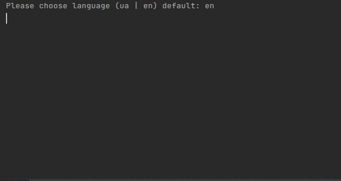

# Description
To run application, open terminal in folder with index.rb and run it

# Installation
```bash
git clone https://github.com/mirkru37/cars-management.git
cd cars-management
```

# Run
```bash
ruby index.rb
```

# Usage
After the start of the application, you need to fill in search rules **one by one**.
If you want **to skip** one, leave an **empty** field.

**Rules are case insensitive**

**Rules marked with * require valid input data**

**Statistic** is stored in *data/searches.yml*

### Table of validation
| Field  | Required value |
| ------------- | ------------- |
| year_(from/to)  | integer between 1800 and today's year  |
| price_(from/to)  | float under zero (**notice** that value will be rounded to two decimal places) |

### Rules
- make - takes one car brand you want to search
  >Input make: _Ford_
  >
  >Input make: ~~Ford Audi~~
- model - takes one car model
  >Input model: Focus 3
  >
  >Input model: ~~Mondeo Focus~~
- year_from - takes the smallest year of searchable cars *
- year_to - takes the biggest year of searchable cars *
  >Input year: 2015
  >
  >Input year: ~~1765 BC~~
  >
  >Input year: ~~two thousand and seventeenth~~
- price_from - takes the smallest price of searchable cars *
- price_to - takes the biggest price of searchable cars *
  >Input price: 20000
  >
  >Input price: ~~20 000~~
  >
  >Input price: ~~twenty thousands~~

After that you can input sort option. If you want **to skip**,
leave an **empty** field, and the **default** one will be chosen.
Also if you input **wrong** option, the **default** one will be chosen.

**Default** sorting is by **date_added** and **desc**

### searches.yml
```yaml
---
  - total_quantity: 2
    request_quantity: 6
    rules:
      - name: make
        value: ford
  - total_quantity: 0
    request_quantity: 3
    rules:
      - name: make
        value: volvo
    result: []
  - total_quantity: 1
    request_quantity: 1
    rules:
      - name: make
        value: ford
      - name: model
        value: focus
      - name: year_from
        value: 2010
      - name: year_to
        value: 2021
      - name: price_from
        value: 0.0
      - name: price_to
        value: 20000.0
```

### Example


___
#### Input
```
Please choose language (ua | en) default: en

Please input search rules(to skip one press enter)
	Input make:
	Input model:
	Input year from:2017
	Input year to:
	Input price from:
	Input price to:20000
Please input sort option (price | date_added) default: date_added
price
Please input sort order (asc | desc) default: desc
asc
Chosen sort option: price sort order: asc
```
#### Output
```
x==================================================================x
|                            Statistic                             |
x=================================x================================x
| Total quantity                  |                              3 |
| Request quantity                |                              1 |
x==================================================================x
|                              Result                              |
x======================x===========================================x
| Field                | Information                               |
x======================x===========================================x
| ID                   | 8841f970-330f-11ec-8d3d-0242ac130003      |
| Make                 | Renault                                   |
| Model                | Megane                                    |
| Year                 | 2018                                      |
| Odometer             | 245000                                    |
| Price                | 10500.0                                   |
| Description          | Car in very good condition, LPG installed |
| Date added           | 28/09/21                                  |
x======================x===========================================x
| ID                   | 1ec46226-330f-11ec-8d3d-0242ac130003      |
| Make                 | Ford                                      |
| Model                | Fusion                                    |
| Year                 | 2017                                      |
| Odometer             | 65000                                     |
| Price                | 18000.0                                   |
| Description          | Selling a good car                        |
| Date added           | 18/09/21                                  |
x======================x===========================================x
| ID                   | 7073efd8-330f-11ec-8d3d-0242ac130003      |
| Make                 | Ford                                      |
| Model                | Focus                                     |
| Year                 | 2017                                      |
| Odometer             | 103000                                    |
| Price                | 19000.0                                   |
| Description          | Like new                                  |
| Date added           | 24/08/21                                  |
x======================x===========================================x
```
___
#### Input
```
Please choose language (ua | en) default: en
ua
Будь-ласка введіть правила пошуку(для пропуску нажміть enter)
	Ввід виробник:ford
	Ввід модель:
	Ввід рік від:1764
Аргумент 1764 повинен бути >= 1800 і <= 2021
	Ввід рік від:
	Ввід рік до:
	Ввід ціна від:-123
Аргумент -123.0 повинен бути >= 0 і <= 1.7976931348623157e+308
	Ввід ціна від:дві тисячі
Аргумент дві тисячі не є число
	Ввід ціна від:
	Ввід ціна до:
Будь-ласка введіть сортувати за (price | date_added) стандартно: date_added

Будь-ласка введіть порядок сортування (asc | desc) стандартно: desc

Вибрано сортувати за: date_added порядок сортування: desc
```
#### Output
```
x=====================================================================x
|                             Статистика                              |
x==================================x==================================x
| Загальна кількість               |                                2 |
| Кількість запитів                |                               11 |
x=====================================================================x
|                              Результат                              |
x==============================x======================================x
| Поле                         | Інформація                           |
x==============================x======================================x
| ID                           | 1ec46226-330f-11ec-8d3d-0242ac130003 |
| Виробник                     | Ford                                 |
| Модель                       | Fusion                               |
| Рік                          | 2017                                 |
| Одометер                     | 65000                                |
| Ціна                         | 18000.0                              |
| Опис                         | Selling a good car                   |
| Дата додавання               | 18/09/21                             |
x==============================x======================================x
| ID                           | 7073efd8-330f-11ec-8d3d-0242ac130003 |
| Виробник                     | Ford                                 |
| Модель                       | Focus                                |
| Рік                          | 2017                                 |
| Одометер                     | 103000                               |
| Ціна                         | 19000.0                              |
| Опис                         | Like new                             |
| Дата додавання               | 24/08/21                             |
x==============================x======================================x
```
